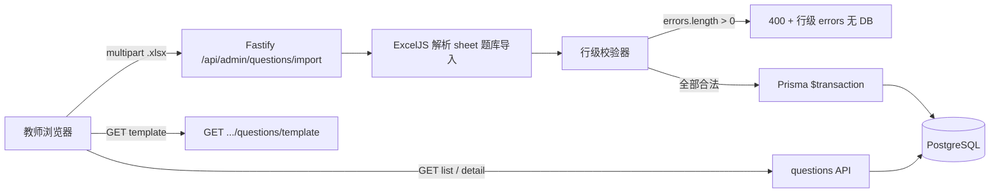

# Phase 2: 题库导入 - Research

**Researched:** 2026-05-16  
**Domain:** Excel `.xlsx` 批量导入、Prisma 题目模型、Fastify 管理端 API、React 管理端预览  
**Confidence:** HIGH（栈与仓库模式）；MEDIUM（计分规则与 UX 为规划建议，待 plan-phase 锁定）

## Summary

Phase 2 在既有 **Fastify + Prisma + PostgreSQL + React 管理端** 上新增题目域：教师上传与仓库模板一致的 `.xlsx`，服务端解析 sheet「题库导入」，校验通过后 **整批原子写入**；非法文件 **零持久化** 并返回行级错误。当前 `prisma/schema.prisma` 仅有 `Teacher`，本阶段需新增题目、选项与导入批次模型。

**Excel 库：** 在服务端使用 **ExcelJS 4.4.0**（`npm view exceljs`）[VERIFIED: npm registry]。通过 `@fastify/multipart` 接收文件 → `data.toBuffer()` → `workbook.xlsx.load(buffer)` [CITED: exceljs README / unpkg 4.1.0+ docs]。不推荐在浏览器再实现一套解析逻辑（避免双份校验）。

**事务策略：** 采用 **「先全量校验、后单次 `$transaction`」**：内存中解析并收集全部行错误；若 `errors.length > 0` 则 `400` 且 **不调用 Prisma 写**；若全部合法，则在 `prisma.$transaction` 内创建 `QuestionImportBatch` + 嵌套 `Question`/`QuestionOption` [CITED: prisma.io transactions]。满足 ROADMAP 成功标准 #2「无半条脏数据」。

**多选题计分（规划须锁定）：** 建议 **全对满分、否则 0 分**（选项集合与正确答案集合完全一致；多选、少选、错选均不得分）。在 `Question.multiScoringRule` 存枚举值，Phase 4 计分直接读取，验收说明写清规则。

**重复导入：** 建议 **仅追加**（每次导入新建 `QuestionImportBatch`，题目 `batchId` 关联）；不做题干去重/覆盖，避免误删。

**Primary recommendation:** 服务端 multipart 上传 + ExcelJS 解析 + 校验失败零写入 + 全对-or-零分多选规则 + 分页列表与详情预览。

## Architectural Responsibility Map

| Capability | Primary Tier | Secondary Tier | Rationale |
|------------|-------------|----------------|-----------|
| `.xlsx` 上传与大小/MIME 限制 | API / Backend | — | 信任边界在服务端；禁止仅客户端校验 |
| 表头/行级业务校验 | API / Backend | — | 与模板契约绑定，需与 DB 写入同事务决策 |
| 解析 sheet「题库导入」 | API / Backend | — | ExcelJS 仅运行在 Node |
| 题目持久化与事务 | Database / Prisma | API orchestration | ACID 由 PostgreSQL + `$transaction` 保证 |
| 官方模板下载 | API / Backend（静态流） | CDN/Static — | 同源 `GET`，与导入校验共用仓库文件 |
| 导入结果/错误展示 | Browser / Client | API 返回 JSON | UI 渲染 `errors[]`、`summary` |
| 题目列表与抽样预览 | Browser / Client | API 分页查询 | 预览数据来自已入库记录，不重复解析 Excel |
| 多选计分规则存储 | Database | API（导入时写入默认值） | Phase 4 阅卷读库，不在前端计算 |

<user_constraints>
## User Constraints (from CONTEXT.md)

### Locked Decisions

- **D-01:** 唯一权威导入格式为 **Excel `.xlsx`**，列定义与 `docs/templates/题库导入模板.xlsx` 一致。
- **D-02:** 数据在 **单个 sheet「题库导入」** 中混排三种题型；sheet「填写说明」**解析时忽略**。
- **D-03:** 表头固定为：`题干`、`题型`、`A`～`F`（可向后扩展 **`G`～`Z`**，空列忽略）、`答案`、`解析`、`知识点`、`难度`、`分值`、`警种`。
- **D-04:** `题型` 必填，接受中文 **`单选` / `多选` / `判断`** 或英文 **`single` / `multi` / `judge`**。
- **D-05:** 以 **`【示例】`** 开头的题干行 **自动跳过**。
- **D-06:** **判断题**：`A`=`正确`、`B`=`错误`；若 A/B 留空则 **系统自动补全**。
- **D-07:** **单选答案**：单个字母。**多选答案**：多个字母，**顿号或逗号**分隔。**判断答案**：`A`/`B` 或 `正确`/`错误`。
- **D-08:** `难度` 可选整数 **1–5**，缺省 **1**；`分值` 可选整数，缺省 **1**；`解析`、`知识点` 选填。
- **D-09:** **`警种` 列本阶段忽略**——不校验、不入库。
- **D-10:** 管理端 **提供「下载官方模板」**，文件为 `docs/templates/题库导入模板.xlsx`。

### Claude's Discretion

- **多选题计分规则**（QBANK-02）：讨论未选定；规划阶段须固定一种并写入验收说明。（本研究建议见下文。）
- **导入失败策略**：ROADMAP 倾向无脏数据；事务边界由 plan-phase 定案。（本研究建议：全批校验通过后一次写入。）
- **预览与列表 UX**：须能核对题干/选项/答案；展示形态由规划提议。
- **重复导入策略**：未讨论；建议 **追加** + `batchId`。

### Deferred Ideas (OUT OF SCOPE)

- **警种字段入库与按警种筛选**（模板列保留，Phase 2 不处理）。
- 在线命题编辑器、题目标签体系、考试组卷与导出（Phase 4）。
</user_constraints>

<phase_requirements>
## Phase Requirements

| ID | Description | Research Support |
|----|-------------|------------------|
| QBANK-01 | 教师能批量导入单选题（题干、选项、正确答案、分值或默认分值策略） | `Question` + `QuestionOption`；解析 `单选`/`single`；默认分值 1；事务批量写入 |
| QBANK-02 | 教师能批量导入多选题（部分分或统一计分规则，规则固定并写入验收说明） | 建议 `MultiScoringRule.ALL_OR_NOTHING` 字段；导入时写入；验收文档引用枚举说明 |
| QBANK-03 | 教师能批量导入判断题（题干、正确判断、分值） | `判断`/`judge` + 自动补全 A/B 文案；答案规范化存 `A`/`B` |
</phase_requirements>

## Standard Stack

### Core

| Library | Version | Purpose | Why Standard |
|---------|---------|---------|--------------|
| exceljs | **4.4.0** | 读取 `.xlsx`、按行迭代 | MIT；`load(buffer)` 适配 multipart；比手写 OOXML 可靠 [VERIFIED: npm registry] |
| @fastify/multipart | **10.0.0** | 教师上传 Excel | Fastify 官方生态；`limits.fileSize` / `files: 1` [VERIFIED: npm registry] [CITED: github.com/fastify/fastify-multipart] |
| @prisma/client | **6.8.2**（已有） | 模型与 `$transaction` | 项目已用；嵌套 create + interactive transaction [CITED: prisma.io] |
| zod | **4.4.3**（已有） | 查询参数、可选 JSON 体 | 与 `login.ts` 一致 |
| react-router-dom | **7.15.1**（已有） | `/admin/questions` 等路由 | 延续 Phase 1 |
| shadcn/ui + lucide | （已有） | 上传、表格、Alert | 延续 `01-UI-SPEC.md` |

### Supporting

| Library | Version | Purpose | When to Use |
|---------|---------|---------|-------------|
| `fs` / `path`（Node 内置） | — | 模板文件 `createReadStream` | `GET .../template` 读 `docs/templates/题库导入模板.xlsx` |
| `@fastify/rate-limit` | **10.3.0**（已有） | 导入接口限流 | 防止大文件频繁上传 |

### Alternatives Considered

| Instead of | Could Use | Tradeoff |
|------------|-----------|----------|
| ExcelJS | SheetJS (`xlsx` 0.18.5) | SheetJS 更轻，但 API 偏「矩阵」、合并单元格与样式边缘情况需更多胶水；**仅服务端**时 ExcelJS 可读性更好 |
| 服务端 multipart | 前端 `xlsx` + `POST` JSON | 前端解析减少服务端内存，但 **双份校验**、更大请求体、与 D-01「权威模板」一致性更难保证 |
| 全批回滚 | 部分成功 + 行级报告 | 部分成功违反 ROADMAP #2；若未来要支持，需 `ImportBatch` 状态机 + 逐行 savepoint（复杂度高） |

**Installation:**

```bash
pnpm --filter @lan-exam/server add exceljs @fastify/multipart
```

**Version verification (2026-05-16):** `npm view exceljs version` → 4.4.0；`npm view xlsx version` → 0.18.5；`npm view @fastify/multipart version` → 10.0.0。

## Architecture Patterns

### System Architecture Diagram



### Recommended Project Structure

```
apps/server/src/
├── lib/
│   └── qbank/
│       ├── parse-workbook.ts      # ExcelJS → 原始行
│       ├── validate-rows.ts       # 业务规则 → ParsedQuestion | RowError[]
│       ├── normalize-answer.ts    # 单选/多选/判断答案规范化
│       └── import-questions.ts    # $transaction 持久化
├── routes/api/admin/
│   ├── questions-import.ts        # POST import
│   ├── questions-template.ts    # GET template
│   └── questions-list.ts        # GET list + :id
apps/web/src/
├── pages/
│   └── AdminQuestions.tsx         # 导入 + 列表 + 预览
├── components/admin/qbank/
│   ├── ImportDropzone.tsx
│   ├── ImportResultSummary.tsx
│   └── QuestionPreviewDialog.tsx
prisma/
├── schema.prisma                  # Question*, QuestionImportBatch
└── migrations/
```

### Pattern 1: 服务端 Multipart → Buffer → ExcelJS

**What:** 单文件上传，限制大小与扩展名，内存解析（题库规模 LAN 场景可接受）。  
**When to use:** 所有教师导入（默认路径）。

```typescript
// Source: [CITED: github.com/fastify/fastify-multipart README]
await app.register(multipart, {
  limits: { fileSize: 5 * 1024 * 1024, files: 1 },
});

const data = await request.file();
if (!data || data.mimetype !== 'application/vnd.openxmlformats-officedocument.spreadsheetml.sheet') {
  return reply.status(400).send({ code: 'INVALID_FILE_TYPE', message: '请上传 .xlsx 文件' });
}
const buffer = await data.toBuffer();
const workbook = new ExcelJS.Workbook();
await workbook.xlsx.load(buffer);
const sheet = workbook.getWorksheet('题库导入') ?? workbook.worksheets[0];
```

### Pattern 2: 两阶段导入（校验与写入分离）

**What:**

1. `parseWorkbook(sheet)` → `RawRow[]`（跳过空行、`【示例】` 题干）
2. `validateRows(raw)` → `{ questions: ParsedQuestion[], errors: RowError[] }`
3. 若 `errors.length > 0` → 返回 `{ ok: false, errors }`，**不**调用 Prisma
4. 否则 `importQuestions(prisma, teacherId, fileName, questions)` 内 `prisma.$transaction(async (tx) => { ... })`

**When to use:** 满足 ROADMAP「非法文件不产生半条脏数据」。

```typescript
// Source: [CITED: prisma.io/docs/orm/prisma-client/queries/transactions]
await prisma.$transaction(async (tx) => {
  const batch = await tx.questionImportBatch.create({
    data: {
      teacherId,
      fileName,
      totalRows: questions.length,
      importedCount: questions.length,
      questions: {
        create: questions.map((q) => ({
          type: q.type,
          stem: q.stem,
          answerKeys: q.answerKeys,
          points: q.points,
          difficulty: q.difficulty,
          explanation: q.explanation,
          knowledgePoints: q.knowledgePoints,
          multiScoringRule: q.type === 'MULTI' ? 'ALL_OR_NOTHING' : null,
          options: { create: q.options },
        })),
      },
    },
  });
  return batch;
}, { timeout: 30000 });
```

### Pattern 3: 表头映射与可扩展列

**What:** 第 1 行必须为规范表头；`A`–`Z` 列通过表头名映射到选项槽位，空列跳过。  
**When to use:** 与 D-03、模板一致。

- 必需列：`题干`、`题型`、`答案`
- 选项列：表头为单个大写字母 `A`–`Z`
- 忽略列：`警种`（读取但不存储）

**模板实测 [VERIFIED: 仓库 `docs/templates/题库导入模板.xlsx` via Python OOXML 解析]：** 含 sheet「题库导入」「填写说明」；数据 sheet 共 4 行（1 表头 + 3 条【示例】单选/判断/多选），与 D-05 跳过策略一致。

### Pattern 4: 管理端路由与 API 契约

**What:** 延续 Phase 1：`requireAdminSession` + `apiFetch` + `credentials: 'include'`。

| Method | Path | 作用 |
|--------|------|------|
| GET | `/api/admin/questions/template` | `Content-Disposition: attachment`，流式发送仓库模板 |
| POST | `/api/admin/questions/import` | `multipart/form-data`，字段名 `file` |
| GET | `/api/admin/questions?page=1&pageSize=20&type=` | 分页列表 |
| GET | `/api/admin/questions/:id` | 预览详情（含 options） |

**Web 路由建议：** `/admin/questions`（`AdminLayout` 子路由）；仪表盘「题库」卡片改为 `Link`。

### Anti-Patterns to Avoid

- **边解析边 `create`：** 第 N 行失败时库内已有 N-1 条 — 违反 ROADMAP #2。
- **仅前端校验：** 绕过 API 直接发包或旧文件 — 必须服务端重复校验。
- **按题干覆盖更新：** 教师重复导入易误覆盖 — 本阶段用 **追加 + batch**。
- **在 Excel 公式单元格依赖计算值：** 使用 `cell.value`/`text`，导入说明要求教师存为值（模板已为文本）。

## Don't Hand-Roll

| Problem | Don't Build | Use Instead | Why |
|---------|-------------|-------------|-----|
| `.xlsx` ZIP/XML 解析 | 自写 OPC 解析 | ExcelJS | 合并单元格、编码、日期序列化 |
| Multipart 解析 | 自写 boundary | @fastify/multipart | 安全默认 `fileSize`/`parts` 限制 |
| 批量 INSERT 事务 | 多条独立 `create` | `prisma.$transaction` + 嵌套 create | 原子性 |
| 登录/会话 | 新鉴权方案 | `requireAdminSession` | Phase 1 已交付 |

**Key insight:** 题目导入的复杂度在 **行级业务规则**（题型、答案、选项空缺），不在文件格式；格式层交给 ExcelJS。

## Common Pitfalls

### Pitfall 1: Sheet 名称或表头轻微不一致

**What goes wrong:** `getWorksheet('题库导入')` 为 `undefined` 或表头对不上，整批报「格式错误」。  
**Why:** 教师另存为、改 sheet 名、删列。  
**How to avoid:** 表头严格匹配（trim 后）；sheet 优先按名查找，否则 **仅当** 仅有一个数据 sheet 时回退 `worksheets[0]`；错误信息写明期望表头。  
**Warning signs:** 400 `INVALID_TEMPLATE` 且无行号。

### Pitfall 2: 多选答案分隔符与空白

**What goes wrong:** `A,B，C`、全角逗号、空格导致判错。  
**How to avoid:** 统一 `split(/[,，、\s]+/)` → 大写字母 → 去重排序 → 与选项键比对。  
**Warning signs:** 合法文件偶发行「答案含非法选项」。

### Pitfall 3: 判断题选项未填

**What goes wrong:** 教师只填答案列。  
**How to avoid:** D-06 导入时补全 `A=正确`、`B=错误`。  
**Warning signs:** 预览缺选项 — 应在写入前补全。

### Pitfall 4: Multipart 未消费流

**What goes wrong:** 请求挂起。  
**How to avoid:** 单文件 `await req.file()` 后 **必须** `toBuffer()` 或消费 `data.file`。  
**Warning signs:** [CITED: fastify-multipart README] 中强调的 hang。

### Pitfall 5: 大文件 OOM

**What goes wrong:** 数千行 + 富文本导致 Node 堆压力。  
**How to avoid:** `fileSize` 上限（建议 **5MB**）；**行数上限**（建议 **2000** 题/次）；日志记录 `import_duration_ms`。  
**Warning signs:** 导入超时或 503。

## Code Examples

### 读取并遍历行（ExcelJS）

```typescript
// Source: [CITED: exceljs README — workbook.xlsx.load / eachRow]
import ExcelJS from 'exceljs';

const workbook = new ExcelJS.Workbook();
await workbook.xlsx.load(buffer);
const sheet = workbook.getWorksheet('题库导入');
if (!sheet) throw new TemplateError('缺少工作表「题库导入」');

const headerRow = sheet.getRow(1);
const headers = normalizeHeaderRow(headerRow);

sheet.eachRow((row, rowNumber) => {
  if (rowNumber === 1) return;
  const stem = cellText(row, headers, '题干');
  if (!stem?.trim()) return;
  if (stem.trim().startsWith('【示例】')) return;
  // ...
});
```

### 多选答案规范化

```typescript
function normalizeMultiAnswer(raw: string): string[] {
  return [...new Set(
    raw
      .split(/[,，、\s]+/)
      .map((s) => s.trim().toUpperCase())
      .filter((k) => /^[A-Z]$/.test(k)),
  )].sort();
}

function normalizeJudgeAnswer(raw: string): 'A' | 'B' {
  const v = raw.trim();
  if (v === 'A' || v === '正确') return 'A';
  if (v === 'B' || v === '错误') return 'B';
  throw new InvalidAnswerError();
}
```

### 注册 admin 路由（与 Phase 1 一致）

```typescript
// Pattern from apps/server/src/routes/api/admin/ping.ts
app.post('/api/admin/questions/import', { preHandler: requireAdminSession }, handler);
```

## Recommended Prisma Model Sketch

> 规划器可微调命名；以下为研究建议 [ASSUMED: 字段名待 plan-phase 锁定]。

```prisma
enum QuestionType {
  SINGLE
  MULTI
  JUDGE
}

enum MultiScoringRule {
  ALL_OR_NOTHING // 全对满分，否则 0 分
}

model QuestionImportBatch {
  id             String     @id @default(cuid())
  teacherId      String
  teacher        Teacher    @relation(fields: [teacherId], references: [id])
  fileName       String
  totalRows      Int
  importedCount  Int
  skippedCount   Int        @default(0)
  createdAt      DateTime   @default(now())
  questions      Question[]
}

model Question {
  id               String            @id @default(cuid())
  batchId          String
  batch            QuestionImportBatch @relation(fields: [batchId], references: [id], onDelete: Cascade)
  type             QuestionType
  stem             String
  answerKeys       String            // 规范化："A" 或 "A,B,C"
  points           Int               @default(1)
  difficulty       Int               @default(1)
  explanation      String?
  knowledgePoints  String?           // 原始字符串或 JSON 数组，由实现择一
  multiScoringRule MultiScoringRule? // 仅 MULTI 必填
  options          QuestionOption[]
  createdAt        DateTime          @default(now())
  @@index([batchId])
  @@index([type])
}

model QuestionOption {
  id         String   @id @default(cuid())
  questionId String
  question   Question @relation(fields: [questionId], references: [id], onDelete: Cascade)
  key        String   // "A".."Z"
  text       String
  sortOrder  Int
  @@unique([questionId, key])
}
```

**多选题计分规则（规划建议 — 须写入 PLAN 验收）：**

| 规则 | 行为 | 推荐 |
|------|------|------|
| `ALL_OR_NOTHING` | 学员所选集合与 `answerKeys` 完全一致才得 `points` | **✓ MVP** |
| `PARTIAL_NO_PENALTY` | 少选按正确项给部分分，错选 0 分 | 后续里程碑 |
| `PROPORTIONAL` | 按正确项比例给分 | 实现与解释成本高 |

**理由 [ASSUMED: 考场常见规则，无校方书面确认]：** 与 QBANK-02「统一计分规则」一致、Phase 4 实现最简单、教师易理解。若校方要求「少选得分」，再换 `PARTIAL_NO_PENALTY`。

## Preview & List UX (Planner Discretion — Recommendation)

| 元素 | 建议 | 对应 ROADMAP |
|------|------|----------------|
| 导入区 | 拖拽/选择 `.xlsx` +「下载官方模板」链到 `GET template` | D-10 |
| 成功反馈 | Toast + 摘要卡：`导入 N 题`、`跳过 M 条示例` | #1 |
| 失败反馈 | 表格列出 `行号`、`列`、`原因`；可下载错误报告 JSON/CSV（可选） | #2 |
| 列表 | 分页 20 条/页，列：题型、题干摘要、分值、导入时间 | #1 |
| 预览 | 行点击打开 Dialog：题干、A–F 选项、答案、解析、知识点 | #3 |
| 抽样 | 导入成功后展示 **本批前 3 题** + 按钮「查看全部」 | #3 抽样 |

延续 `01-UI-SPEC.md`：zinc、中文、Alert destructive、按钮 loading。

## Security Domain

### Applicable ASVS Categories (Level 1)

| ASVS Category | Applies | Standard Control |
|---------------|---------|------------------|
| V2 Authentication | yes | 已有 Session；导入路由 `requireAdminSession` |
| V3 Session Management | yes | 同 Phase 1 HttpOnly `sid` |
| V4 Access Control | yes | 仅 `mustChangePassword=false` 的教师 |
| V5 Input Validation | yes | 文件类型/大小/行数；Zod 校验 query；行级业务校验 |
| V6 Cryptography | no（本阶段无新加密需求） | — |

### Known Threat Patterns

| Pattern | STRIDE | Standard Mitigation |
|---------|--------|---------------------|
| 未授权导入 | Elevation | `requireAdminSession` |
| 超大文件 DoS | Denial of Service | `fileSize` 5MB、`row` 2000、rate limit |
| 恶意 xlsx（zip bomb） | DoS | 大小限制 + 行数上限；勿执行宏 |
| MIME 伪造 | Tampering | 扩展名 + mimetype + ZIP 魔数 `PK\x03\x04` |
| 错误信息泄露 | Information disclosure | 行级错误不含堆栈；日志不含文件全文 |

## Environment Availability

| Dependency | Required By | Available | Version | Fallback |
|------------|-------------|-----------|---------|----------|
| Node.js | server + exceljs | ✓ | v22.22.0（探测环境） | — |
| pnpm | monorepo | ✓ | 9.x（packageManager） | — |
| PostgreSQL | Prisma | ✓（Compose） | 15+ [ASSUMED] | 开发需 `docker compose up` |
| Python 3 | 仅研究解析模板 | ✓ | 3.12 | 非运行时依赖 |

**Step 2.6 note:** 执行阶段需 DB 与种子教师登录；与 Phase 1 相同。

## Project Constraints (from .cursor/rules/)

`.cursor/rules/` **不存在** [VERIFIED: Glob 0 files]。无额外规则文件约束；遵循 Phase 1 既有模式（Zod、中文 UI、`apiFetch`、admin guard）。

## State of the Art

| Old Approach | Current Approach | When Changed | Impact |
|--------------|------------------|--------------|--------|
| 无题目表 | Prisma 关系模型 + 批次 | Phase 2 | Phase 4 组卷直接 FK |
| 仪表盘占位 disabled | 可导航题库页 | Phase 2 | `AdminDashboard.tsx` 改 Link |

## Assumptions Log

| # | Claim | Section | Risk if Wrong |
|---|-------|---------|---------------|
| A1 | 多选采用 `ALL_OR_NOTHING` | Prisma / QBANK-02 | Phase 4 计分与校方规则不符需迁移枚举 |
| A2 | 单次导入上限 2000 行 / 5MB | Pitfalls / Security | 超大题库需分批导入或调限 |
| A3 | `knowledgePoints` 存为单字符串 | Prisma sketch | 若需按标签检索需改 JSON/关联表 |
| A4 | 模板 sheet 名恒为「题库导入」 | Pattern 3 | 教师改 sheet 名导致失败 — 靠错误提示缓解 |

## Open Questions

1. **是否在列表按 `batchId` 筛选？**
   - What we know: 追加策略依赖 batch。
   - Recommendation: 列表默认「全部」，可选筛选「最近一次导入」。

2. **知识点字段拆分存储？**
   - What we know: D-08 允许多值分隔。
   - Recommendation: MVP 存原始字符串；Phase 4 前若需筛选再拆表。

## Sources

### Primary (HIGH confidence)

- [VERIFIED: npm registry] — `exceljs@4.4.0`, `@fastify/multipart@10.0.0`, `xlsx@0.18.5`
- [VERIFIED: 仓库] — `prisma/schema.prisma`, `apps/server/src/plugins/admin-guard.ts`, `docs/templates/题库导入模板.xlsx`（OOXML 结构）
- [CITED: prisma.io/docs/orm/prisma-client/queries/transactions] — interactive transactions
- [CITED: github.com/fastify/fastify-multipart] — limits, `toBuffer()`, security defaults

### Secondary (MEDIUM confidence)

- [CITED: exceljs README via unpkg 4.1.0+] — `workbook.xlsx.load`, `eachRow`
- `.planning/phases/02-qbank-import/02-CONTEXT.md` — 全部 D-01–D-10

### Tertiary (LOW confidence)

- Context7 CLI — quota exceeded；已用官方 README / npm 替代

## Metadata

**Confidence breakdown:**

- Standard stack: **HIGH** — 版本 npm 实测；库与 Fastify 5 兼容
- Architecture: **HIGH** — 与 ROADMAP、CONTEXT、现有代码结构对齐
- Pitfalls: **MEDIUM** — 边界数据依赖真实教师文件回归
- 计分规则: **MEDIUM** — 建议合理但未经用户书面确认（见 Assumptions A1）

**Research date:** 2026-05-16  
**Valid until:** 2026-06-16（ExcelJS / Fastify 小版本可跟进）

## RESEARCH COMPLETE

**Phase:** 2 - 题库导入  
**Confidence:** HIGH（技术栈与导入管道）；MEDIUM（计分与 UX 建议）

### Key Findings

- 服务端 **ExcelJS + @fastify/multipart** 单路径解析，避免前后端双校验。
- **先校验全部行、再一次 Prisma `$transaction`** 最符合「无半条脏数据」。
- 多选建议 **全对满分否则 0 分**，写入 `MultiScoringRule` 供 Phase 4 使用。
- 重复导入 **仅追加**，用 `QuestionImportBatch` 追溯来源。
- 模板已验证含三种【示例】行，与 D-05 跳过逻辑一致。

### File Created

`.planning/phases/02-qbank-import/02-RESEARCH.md`

### Confidence Assessment

| Area | Level | Reason |
|------|-------|--------|
| Standard Stack | HIGH | npm 版本已查；与现有 Fastify/Prisma 一致 |
| Architecture | HIGH | 对齐 ROADMAP 成功标准与 Phase 1 模式 |
| Pitfalls | MEDIUM | 需真实 xlsx 回归测试 |
| Scoring rule | MEDIUM | 规划建议，待用户/验收确认 |

### Open Questions

- 列表是否默认按批次筛选（建议可选）。
- 知识点是否拆分为数组存储（MVP 可存字符串）。

### Ready for Planning

Research complete. Planner can now create PLAN.md files (02-01～02-03).
