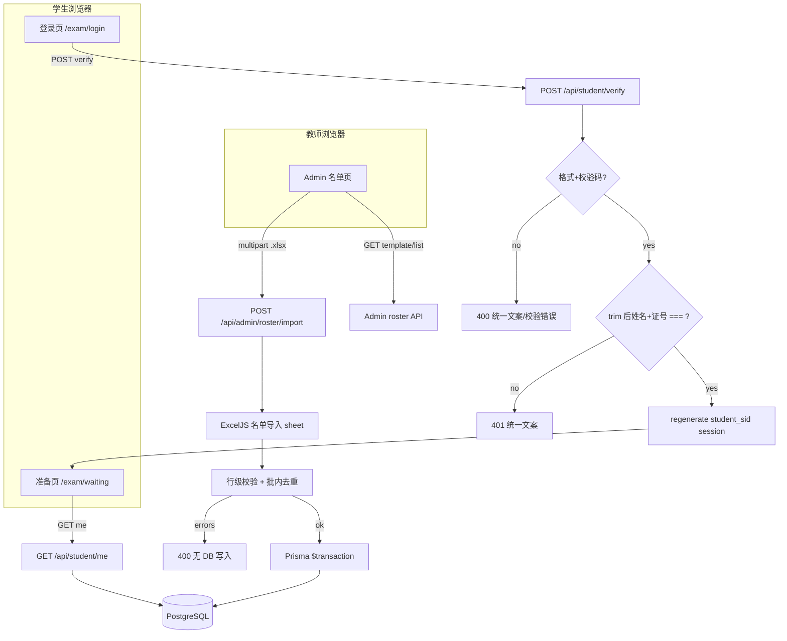

# Phase 3: 名单与学生入场 - Research

**Researched:** 2026-05-16  
**Domain:** Excel roster import, Prisma roster models, dual student/teacher sessions, Chinese national ID validation, student SPA routes  
**Confidence:** HIGH（栈、Phase 1–2 模式、GB 11643 校验算法）；MEDIUM（双 session 挂载细节、规划建议项）

## Summary

Phase 3 在既有 **Fastify + Prisma + PostgreSQL + ExcelJS + React** 栈上新增 **名单域** 与 **学生入场域**：教师通过官方 `.xlsx` 导入「姓名 + 18 位身份证号」；管理端检索确认（ROST-01）；学生在独立入口提交相同两字段，**trim 后逐字符完全一致** 且通过 **格式+校验码** 校验后建立 **独立 `student_sid` Cookie 会话**，进入准备页（AUTH-02）。当前 `prisma/schema.prisma` **无** 名单模型；`session.d.ts` 仅有 `teacherId`；学生端 `Home.tsx` 仍为占位。

**导入管道：** 镜像 Phase 2 的 **multipart → ExcelJS → 行级校验 → 单次 `$transaction`**；复用 `assertValidXlsxUpload`（`apps/server/src/lib/qbank/xlsx-file.ts`）与 `parse-workbook` 的表头/示例行/行数上限模式。建议 sheet 名 **`名单导入`**，列 **`姓名`**、**`身份证号`**，模板置于 `docs/templates/名单导入模板.xlsx`。

**身份证：** 比对 **仅 `trim()`**（D-03）；格式门闸用 **GB 11643-1999 MOD 11-2 校验码**（D-04），建议 **`lib/roster/national-id.ts` 内 ~40 行纯函数 + 单元测试**，**不** 引入 `idcard`（4.2.0）等会附带区域码库或可能规范化大小写的包 [VERIFIED: npm registry — `idcard` 783KB、含 `info`/`upgrade15To18` 等超出本阶段需求]。

**会话：** 教师继续 `sid` + `teacherId`；学生 **`student_sid` + `studentRosterEntryId` + `studentName`**（D-05、D-07）。同一 `connect-pg-simple` 表可存两套 session id；须用 **链式双 `express-session` 中间件** 避免后挂载覆盖 `req.session`（见架构模式）。

**Primary recommendation:** `RosterImportBatch`/`RosterEntry` + 全批校验后事务写入 + 独立 `student_sid` 会话 + `POST /api/student/verify` 统一失败文案与 rate limit + `GET /api/student/me` 按 `rosterEntryId` 回读全号。

## Architectural Responsibility Map

| Capability | Primary Tier | Secondary Tier | Rationale |
|------------|-------------|----------------|-----------|
| `.xlsx` 名单上传与文件类型校验 | API / Backend | — | 与题库相同信任边界 |
| 行级姓名/身份证校验与批内去重 | API / Backend | — | 业务规则与 DB 唯一约束绑定 |
| 名单持久化（批次 + 条目） | Database / Prisma | API orchestration | Phase 4 关联考试需 `batchId`/`rosterEntryId` |
| 管理端名单检索/列表 | Browser / Client | API 分页/搜索 | ROST-01 预览与检索 |
| 官方模板下载 | API / Backend（文件流） | — | 与 `questions-template.ts` 同模式 |
| 学生姓名+身份证校验 | API / Backend | Browser 表单校验（可选） | AUTH-02；服务端为权威 |
| 18 位格式+校验码门闸 | API / Backend | Browser（可选提前提示） | D-04：非法则不查库 |
| 名单精确匹配（trim 后 `===`） | API / Backend | — | D-03 禁止 x/X、全角等转换 |
| 学生会话创建/销毁 | API / Backend | — | `student_sid` Cookie + PG store |
| 准备页展示姓名+全号 | Browser / Client | `GET /api/student/me` | D-06/D-07：session 不存证件号 |
| 统一失败文案（防枚举） | API / Backend | — | ROADMAP #3；对齐 `login.ts` |
| 学生/教师路由守卫 | Browser / Client | API `preHandler` | 无 session 不可进准备页 |

<user_constraints>
## User Constraints (from CONTEXT.md)

### Locked Decisions

- **D-01:** 学生端与导入名单均使用 **18 位完整身份证号**；AUTH-02 为姓名 + 身份证 **两字段同时精确匹配**（匹配前规范化见 D-03）。
- **D-02:** 名单库内身份证号 **明文存储**（机房内网封闭场景；导出/日志脱敏策略在 Phase 4 或部署文档中另行约定，本阶段不实现导出）。
- **D-03:** 比对前规范化 **仅限去除首尾空格**；**不** 自动统一 `x`/`X`、全角/半角或其他转换；导入模板与填写说明须要求教师按证件字面填写（除首尾空格外须一致）。
- **D-04:** 学生提交前与服务端均校验 **18 位身份证格式 + 校验码算法**；格式非法时 **直接拒绝，不查询名单**（减少无效查库与试探）。
- **D-05:** 校验通过后建立 **独立学生 Session**，与教师 Session **分离**（教师 Cookie `sid` 不变；学生使用独立 Cookie 名，建议 `student_sid`）；同样 **HttpOnly Cookie + PostgreSQL session 存储**（对齐 Phase 1 `connect-pg-simple` 模式）。
- **D-06:** 准备页展示：**完整姓名 + 完整身份证号** + 固定文案 **「请等待监考教师开始考试」**（用户明确要求全号展示；机房内网可接受，须在 UI 上避免非必要二次传播）。
- **D-07:** Session 内保存 **`rosterEntryId`（名单记录主键）+ 姓名**；**不** 将身份证号写入 session；准备页所需全号由 **已认证学生 API** 按 `rosterEntryId` 从库读取后返回。
- **D-08:** 准备页提供 **「退出」**；销毁学生 session 后回到学生登录页；刷新准备页 **保持登录** 直至用户退出或 session 过期（默认 TTL 由规划与 Phase 1 session 配置对齐，建议与教师 session 同级如 8h，除非校方要求更短）。

### Claude's Discretion

- **名单导入格式与批次（原灰区 2）** — 建议沿用 Phase 2 模式：**官方 Excel `.xlsx` 模板**（`docs/templates/` 下新增名单模板，列：**姓名**、**身份证号**）；multipart 上传 + 行级校验 + 管理端「下载模板」；**导入批次**（`RosterImportBatch`）入库以便 Phase 4「考试关联名单」；重复 `(姓名, 身份证)` 策略建议 **拒绝本行并报告** 或 **全批拒绝**（避免静默覆盖，与题库 ALL_OR_NOTHING 精神一致）。具体表头、示例行跳过规则由规划写入 PLAN。
- **校验失败提示与防试探（原灰区 3）** — 建议与教师登录一致：**单一笼统文案**（不区分姓名错/证件错/不存在，满足 ROADMAP 成功标准 #3）；对 `POST` 学生校验接口施加 **rate limit**（参考题库 `IMPORT_RATE_LIMIT` 环境变量模式）；是否在 N 次失败后临时锁定 IP/会话由规划按 ASVS L1 建议取值。
- **管理端名单 UI** — ROST-01 要求检索：支持按姓名或证件号查询；列表是否默认脱敏显示证件号由规划提议（**讨论未锁**；与 D-06 学生端全号展示可并存：教师端可脱敏、学生端本人可见全号）。
- **学生路由结构** — 建议 `/` 或 `/exam/login` 为学生登录，`/exam/waiting`（或等价路径）为准备页；需 **学生路由守卫**（无 session 不可进准备页）；与 `/admin/*` 隔离。

### Deferred Ideas (OUT OF SCOPE)

- **名单导入 Excel 列布局、批次与重复策略**（原灰区 2）— 本研究给出默认建议，plan-phase 写入 PLAN 验收
- **失败提示文案与 rate limit 细节**（原灰区 3）— 本研究给出默认建议
- **管理端列表证件号脱敏展示** — 未讨论；本研究建议教师端脱敏
- **导出与日志中身份证脱敏** — Phase 4（EXPR）或部署合规文档
- 考试组卷、答题、提交、成绩导出 — Phase 4
</user_constraints>

<phase_requirements>
## Phase Requirements

| ID | Description | Research Support |
|----|-------------|------------------|
| ROST-01 | 教师能批量导入考试名单列：姓名、身份证号；导入后可在管理端预览或检索以确认 | `RosterImportBatch` + `RosterEntry`；ExcelJS 管道；`GET/POST /api/admin/roster/*`；`/admin/roster` UI；`@@unique([fullName, nationalId])` + 批内重复检测 |
| AUTH-02 | 学生输入姓名与身份证号后，系统与已导入名单逐字段匹配，仅全部一致时允许进入待参加的考试 | `POST /api/student/verify`；trim + 格式门闸 + DB 精确匹配；`student_sid` session；`/exam/waiting`；统一失败文案 |
</phase_requirements>

## Standard Stack

### Core

| Library | Version | Purpose | Why Standard |
|---------|---------|---------|--------------|
| exceljs | **4.4.0** | 读取名单 `.xlsx` | 项目已安装 [VERIFIED: `apps/server/package.json`] |
| @fastify/multipart | **10.0.0** | 教师上传 | Phase 2 已注册 `limits.fileSize: 5MB` [VERIFIED: `apps/server/src/index.ts`] |
| @prisma/client | **6.8.2** | 名单模型与事务 | 与 `import-questions.ts` 一致 |
| express-session + connect-pg-simple | **1.19.0 / 10.0.0** | 教师 `sid` + 学生 `student_sid` | Phase 1 已交付 [VERIFIED: `plugins/session.ts`] |
| zod | **4.4.3** | verify body、查询参数 | 与 `login.ts` 一致 |
| react-router-dom | **7.x**（web 已有） | `/exam/*`、`/admin/roster` | 延续 `router.tsx` 模式 |

### Supporting

| Library | Version | Purpose | When to Use |
|---------|---------|---------|-------------|
| Node `fs` + `getRepoRoot()` | — | 模板下载流 | 镜像 `questions-template.ts` |
| @fastify/rate-limit | **10.3.0** | 学生 verify、名单 import | 镜像 `LOGIN_RATE_LIMIT` / `IMPORT_RATE_LIMIT` |

### Alternatives Considered

| Instead of | Could Use | Tradeoff |
|------------|-----------|----------|
| 自研 `national-id.ts`（仅校验码） | npm `idcard` 4.2.0 | 包体大、可能隐含 15 位升级/区域校验；与 D-03「字面一致」耦合弱 — **不推荐** |
| 单 session 存 `teacherId` + `studentRosterEntryId` | 双 Cookie（D-05 已锁） | 违反用户决策 |
| 证件号哈希存储 | 明文（D-02 已锁） | 无法 trim 后字面精确匹配 |
| 学生 JWT | HttpOnly session | 违背 Phase 1 D-04 方向 |

**Installation:** 无新增运行时依赖（ExcelJS、multipart、session 已存在）。

**Version verification (2026-05-16):** `npm view exceljs version` → 4.4.0；`npm view idcard version` → 4.2.0（未采用）。

## Architecture Patterns

### System Architecture Diagram



### Recommended Project Structure

```
apps/server/src/
├── lib/
│   ├── roster/
│   │   ├── types.ts              # REQUIRED_HEADERS, SHEET_NAME, RowError
│   │   ├── national-id.ts        # isValidNationalIdFormat (GB 11643)
│   │   ├── parse-workbook.ts     # ExcelJS → RawRosterRow[]
│   │   ├── validate-rows.ts      # 行级 + 批内重复 + 格式
│   │   └── import-roster.ts      # $transaction 写 batch + entries
│   ├── student-auth.ts           # getStudentSession, constants
│   └── qbank/xlsx-file.ts        # 复用或抽到 lib/xlsx-file.ts
├── plugins/
│   ├── session.ts                # 扩展：双 session 链
│   └── student-guard.ts          # requireStudentSession
├── routes/api/
│   ├── admin/
│   │   ├── roster-import.ts
│   │   ├── roster-template.ts
│   │   └── roster-list.ts        # list + search q=
│   └── student/
│       ├── verify.ts
│       ├── me.ts
│       └── logout.ts
apps/web/src/
├── pages/
│   ├── StudentLogin.tsx
│   ├── StudentWaiting.tsx
│   └── AdminRoster.tsx
├── components/
│   ├── auth/StudentRoute.tsx
│   └── admin/roster/...
prisma/schema.prisma                # RosterImportBatch, RosterEntry
docs/templates/名单导入模板.xlsx
```

### Pattern 1: 名单导入（镜像题库两阶段）

**What:** `parseWorkbook` → `validateRows` → 有错误则 400 + `errors[]` 且 **零 Prisma 写**；否则 `importRoster` 单次 `$transaction` 创建 `RosterImportBatch` + 嵌套 `entries`。

**When to use:** 所有 `POST /api/admin/roster/import`。

**重复策略（规划建议，ALL_OR_NOTHING）：**

1. **批内：** `Map<"${fullName}\0${nationalId}", rowNumber>` 检测重复，两行均报行级错误。
2. **批外：** 校验阶段 `findMany` 现有 `(fullName, nationalId)` 或依赖 DB `@@unique` — 推荐 **校验阶段预检** + 行级错误「与已有名单重复」，避免整事务失败难读。
3. **禁止** 静默覆盖或 upsert 覆盖旧记录。

**行数上限：** 建议 **`MAX_ROSTER_IMPORT_ROWS = 2000`**（与 `MAX_IMPORT_ROWS` 一致）[VERIFIED: `apps/server/src/lib/qbank/types.ts`]。

### Pattern 2: 身份证格式门闸（D-04）与精确匹配（D-03）

**What:**

1. `fullName = rawName.trim()`，`nationalId = rawId.trim()`（**仅此规范化**）。
2. `isValidNationalIdFormat(nationalId)` — 长度 18、前 17 位数字、第 18 位 `0-9` 或 `X`/`x`，校验码按 GB 11643 计算；**不** 为匹配而改写存储值。
3. 非法 → **400** `VALIDATION_ERROR`（学生端可显示「身份证号格式不正确」类 **非枚举** 文案 — 不暴露名单是否存在；与「组合错误」401 区分仅限格式，仍不暗示姓名对错）。
4. 合法 → `prisma.rosterEntry.findFirst({ where: { fullName, nationalId } })` — **精确相等**。
5. 未找到 → **401** + 与登录相同的 **单一业务文案**（见 Code Examples）。

**Checksum 权重 [CITED: GB 11643-1999 / Wikisource 公民身份号码]:**  
`W = [7,9,10,5,8,4,2,1,6,3,7,9,10,5,8,4,2]`；`check = '10X98765432'[sum % 11]`；比较时第 18 位 **仅校验码位** 可用 `toUpperCase()` 判断合法性，**入库与匹配仍保存/比较原始字符**。

### Pattern 3: 双 Session（D-05）

**What:** 保留现有 `session({ name: 'sid', ...})` 与 `getRequestSession()` → `teacherId`；新增 `session({ name: 'student_sid', ...})` 链式挂载，将学生 session 存 **`request.raw.studentSession`**（或 Fastify `declare module` 扩展），**勿** 让第二阶段覆盖教师 `req.session`。

**When to use:** 所有 `/api/student/*` 与全局 `onRequest` 链。

```typescript
// Source: [CITED: express-session — `name` option; dual middleware pattern per community]
// MEDIUM confidence — 实现时须集成测试：同机同时登录教师+学生 Cookie 互不覆盖

export function dualSessionPlugin(teacherOpts, studentOpts) {
  const teacherMw = session(teacherOpts);
  const studentMw = session({ ...studentOpts, name: 'student_sid' });
  return (req, res, next) => {
    teacherMw(req, res, (err) => {
      if (err) return next(err);
      const teacherSession = req.session;
      studentMw(req, res, (err2) => {
        if (err2) return next(err2);
        (req as any).studentSession = req.session;
        req.session = teacherSession;
        next();
      });
    });
  };
}
```

**Session 字段（`session.d.ts`）：**

```typescript
interface SessionData {
  teacherId?: string;
  studentRosterEntryId?: string;
  studentName?: string; // D-07 姓名快照，便于 /me 少一次查库（可选，仍以 DB 为准）
}
```

**学生登录成功：** 仅对 `studentSession` 调用 `regenerate`，写入 `studentRosterEntryId`、`studentName`；**不** 调用教师 session 的 regenerate。

**TTL：** 当前 `sid` 为 `maxAge: 24h` [VERIFIED: `plugins/session.ts`]；CONTEXT 建议 8h — plan-phase 可增 `SESSION_MAX_AGE_MS` 环境变量统一两者。

### Pattern 4: 学生 API 与路由

| Method | Path | Auth | 作用 |
|--------|------|------|------|
| POST | `/api/student/verify` | 无 | body `{ fullName, nationalId }` → 建 `student_sid` |
| GET | `/api/student/me` | `requireStudentSession` | `{ fullName, nationalId }` 来自 `rosterEntryId` |
| POST | `/api/student/logout` | 学生 session | `studentSession.destroy` |

| Web 路径 | 守卫 |
|----------|------|
| `/exam/login` 或 `/` | 已登录学生 redirect → waiting |
| `/exam/waiting` | 无学生 session → login |
| `/admin/roster` | `RequireAuthenticatedAdmin` |

**常量文案（规划建议）：**

```typescript
export const STUDENT_AUTH_ERROR_MESSAGE =
  '姓名或身份证号不正确，请检查后重试。' as const;
```

对齐 `AUTH_ERROR_MESSAGE` 模式 [VERIFIED: `apps/server/src/lib/errors.ts`]。

**Rate limit：** `STUDENT_VERIFY_RATE_LIMIT_MAX` 默认 **20**/分钟；`ROSTER_IMPORT_RATE_LIMIT_MAX` 默认 **10**/分钟（镜像 import）。

### Pattern 5: 管理端检索（ROST-01）

**What:** `GET /api/admin/roster?query=&page=&pageSize=` — `query` trim 后非空则 `OR: [{ fullName: { contains } }, { nationalId: { contains } }]`（Prisma `mode: 'insensitive'` **仅用于姓名** 可选；**身份证号建议敏感大小写用 equals/startsWith** 若需部分匹配用 `contains` 但不改变证号大小写）。

**列表脱敏（规划建议，未锁）：** 教师 UI 显示 `110101********1234`（保留前6后4）；详情/搜索命中行可提供「显示全号」二次点击（可选）。

### Anti-Patterns to Avoid

- **在 session 存 `nationalId`：** 违反 D-07；扩大 XSS/会话泄露面。
- **证号 `toUpperCase()` 后匹配：** 违反 D-03。
- **区分「姓名错」「证号错」「不存在」：** 违反 ROADMAP #3。
- **格式非法仍 `findFirst`：** 违反 D-04；助长枚举与 DB 噪声。
- **失败日志打印完整证号：** 违反隐私最小化；记 `event: student_verify_failed` 即可。
- **学生 API 复用 `requireAdminSession`：** 错误守卫。
- **把学生会话写入 `teacherId`：** 语义混淆，Phase 4 难维护。

## Don't Hand-Roll

| Problem | Don't Build | Use Instead | Why |
|---------|-------------|-------------|-----|
| `.xlsx` 解析 | 自写 OPC | ExcelJS | Phase 2 已验证 |
| Multipart | 自写 boundary | @fastify/multipart | 大小/类型限制 |
| Session 存储 | 内存 Map | connect-pg-simple | 重启不丢会话 |
| 校验码算法拷贝粘贴无测试 | 裸函数无测试 | `national-id.ts` + **单元测试** 向量 | GB 11643 易错位权 |
| 完整身份证库（区域码） | `idcard` 全量 | 仅格式+校验码 | D-04 不要求区域码合法 |
| 登录暴力试探 | 无限制 verify | `@fastify/rate-limit` per-route | ASVS L1 |

## Common Pitfalls

### Pitfall 1: 双 session 覆盖 `req.session`

**What goes wrong:** 第二个 `express-session` 中间件使 `getSessionTeacherId` 读不到 `teacherId`。  
**How to avoid:** 链式挂载 + `studentSession` 独立属性；集成测试：教师已登录时学生 verify 不影响 `/api/auth/me`。  
**Warning signs:** 教师 401 或学生登录后教师被登出。

### Pitfall 2: Excel 科学计数法毁掉证号

**What goes wrong:** 单元格格式为数字，`440882199100201232` 变成 `4.40882E+17`。  
**How to avoid:** 模板 **文本格式** 列 + 填写说明；解析用 `cellText`（与 `parse-workbook.ts` 一致）读 **显示文本**；校验 `/^\d{17}[\dXx]$/` 长度 18。  
**Warning signs:** 导入后证号长度 ≠ 18。

### Pitfall 3: 校验码通过但大小写与名单不一致

**What goes wrong:** 用户输入末位 `x`，名单存 `X`，格式校验用 `toUpperCase` 通过但 `===` 失败。  
**Why:** D-03 字面一致。  
**How to avoid:** 模板与登录页说明「与证件完全一致」；格式校验与 **匹配分离**。

### Pitfall 4: 统一文案却在 HTTP 状态/字段上泄露

**What goes wrong:** 404 vs 401、或 `field: 'nationalId'` 暗示证号问题。  
**How to avoid:** 组合失败一律 **401** + 同一 `code`（如 `INVALID_STUDENT_CREDENTIALS`）；格式错误单独 **400** 且不提名单。

### Pitfall 5: `findFirst` 无唯一约束导致重复行

**What goes wrong:** 重复导入产生两条相同 `(姓名, 证号)`，`findFirst` 不确定。  
**How to avoid:** DB `@@unique([fullName, nationalId])` + 导入预检。

### Pitfall 6: 管理端搜索日志/URL 带全证号

**What goes wrong:** 浏览器历史、代理日志泄露。  
**How to avoid:** POST 搜索或确保仅 HTTPS/内网；教师端列表默认脱敏。

## Code Examples

### GB 11643 校验码（格式门闸）

```typescript
// Source: [CITED: GB 11643-1999 校验码 / npm idcard README 权重表一致]
const WEIGHTS = [7, 9, 10, 5, 8, 4, 2, 1, 6, 3, 7, 9, 10, 5, 8, 4, 2] as const;
const CHECK_CHARS = '10X98765432';

export function isValidNationalIdFormat(id: string): boolean {
  if (id.length !== 18) return false;
  const body = id.slice(0, 17);
  if (!/^\d{17}$/.test(body)) return false;
  const last = id[17];
  if (!/^[\dXx]$/.test(last)) return false;
  let sum = 0;
  for (let i = 0; i < 17; i++) sum += Number(body[i]) * WEIGHTS[i];
  return last.toUpperCase() === CHECK_CHARS[sum % 11];
}
```

### 学生 verify 处理顺序

```typescript
// Pattern from apps/server/src/routes/api/auth/login.ts
const body = verifyBodySchema.parse(request.body);
const fullName = body.fullName.trim();
const nationalId = body.nationalId.trim();

if (!isValidNationalIdFormat(nationalId)) {
  return reply.status(400).send({ code: 'VALIDATION_ERROR', message: '身份证号格式不正确' });
}

const entry = await prisma.rosterEntry.findFirst({
  where: { fullName, nationalId },
});

if (!entry) {
  request.log.warn({ event: 'student_verify_failed' }, 'Student verify failed');
  return reply.status(401).send({
    code: 'INVALID_STUDENT_CREDENTIALS',
    message: STUDENT_AUTH_ERROR_MESSAGE,
  });
}

await regenerateStudentSession(request);
const sess = getStudentSession(request)!;
sess.studentRosterEntryId = entry.id;
sess.studentName = entry.fullName;
return reply.send({ ok: true });
```

### Prisma 模型草图

```prisma
model RosterImportBatch {
  id            String        @id @default(cuid())
  teacherId     String
  teacher       Teacher       @relation(fields: [teacherId], references: [id])
  fileName      String
  totalRows     Int
  importedCount Int
  skippedCount  Int           @default(0)
  createdAt     DateTime      @default(now())
  entries       RosterEntry[]

  @@index([teacherId])
}

model RosterEntry {
  id           String            @id @default(cuid())
  batchId      String
  batch        RosterImportBatch @relation(fields: [batchId], references: [id], onDelete: Cascade)
  fullName     String
  nationalId   String
  createdAt    DateTime          @default(now())

  @@unique([fullName, nationalId])
  @@index([fullName])
  @@index([nationalId])
}
```

Teacher 增加：`rosterImportBatches RosterImportBatch[]`。

### 注册 import 路由（镜像题库）

```typescript
// From apps/server/src/routes/api/admin/questions-import.ts
app.post('/api/admin/roster/import', {
  preHandler: requireAdminSession,
  config: {
    rateLimit: {
      max: Number(process.env.ROSTER_IMPORT_RATE_LIMIT_MAX ?? 10),
      timeWindow: '1 minute',
    },
  },
}, handler);
```

## State of the Art

| Old Approach | Current Approach | When Changed | Impact |
|--------------|------------------|--------------|--------|
| 学生端占位 `Home.tsx` | `/exam/login` + `/exam/waiting` | Phase 3 | 替换根路径学生流 |
| 无名单表 | `RosterEntry` + batch | Phase 3 | Phase 4 `exam` 外键 |
| 仅 `teacherId` session | + `student_sid` | Phase 3 | 须扩展 session 插件 |

**Deprecated/outdated:**

- 仪表盘「名单」灰色不可点 — 本阶段改为 `Link` 至 `/admin/roster`（镜像题库卡片）。

## Assumptions Log

| # | Claim | Section | Risk if Wrong |
|---|-------|---------|---------------|
| A1 | 链式双 `express-session` + `studentSession` 属性可行 | Pattern 3 | 需 Spike；若失败改 `fastify-secure-session` 第二 cookie |
| A2 | 格式错误用 400、组合错误用 401 不视为「组合泄露」 | Pattern 2 | 用户若要求全部 401 须改验收 |
| A3 | `@@unique([fullName, nationalId])` 全局唯一可接受 | Prisma sketch | 若允许同人多次考试批次需改唯一键 |
| A4 | 教师列表默认脱敏 | Pattern 5 | 与 ROST-01「检索确认」冲突时可改为全号 |
| A5 | `SESSION_MAX_AGE` 24h 可继续用于学生 | Pattern 3 | CONTEXT 建议 8h 时需 env 统一 |

## Open Questions (RESOLVED)

1. **学生登录 URL：`/` vs `/exam/login`** — **RESOLVED:** `03-02-PLAN.md` 采用 `/exam/login` 为主入口，`/` 重定向至 login（未登录）或 waiting（已登录学生 session）。

2. **格式错误 400 文案是否算「泄露」** — **RESOLVED:** 格式非法返回 400「身份证号格式不正确」（不查库、不暗示名单存在）；姓名+证号组合失败返回 401 统一文案「姓名或身份证号不正确，请检查后重试。」（`03-02-PLAN.md` Task 1）。

3. **跨批次重复是否拒绝导入** — **RESOLVED:** **拒绝** — `03-01-PLAN.md` Task 1 预检 + `@@unique([fullName, nationalId])`；行级错误「该姓名与身份证号已存在于名单中」。

## Environment Availability

**Step 2.6:** SKIPPED — 无 Phase 3 专属外部依赖；沿用 Phase 1–2（Node、PostgreSQL、pnpm、ExcelJS 已就绪）。

| Dependency | Required By | Available | Version | Fallback |
|------------|------------|-----------|---------|----------|
| PostgreSQL | Session + roster | ✓（Compose） | 16 | — |
| exceljs | Roster import | ✓ | 4.4.0 | — |
| @fastify/multipart | Upload | ✓ | 10.0.0 | — |

## Project Constraints (from .cursor/rules/)

- **Core value / 合规：** 身份证号属敏感个人信息；本阶段明文存储（D-02）须在 SECURITY/plan 记录内网威胁假设；导出/日志脱敏延至 Phase 4 [VERIFIED: `.cursor/rules` PROJECT 段]。
- **GSD workflow：** 计划外直接改库应先经 GSD 执行流 [VERIFIED: `.cursor/rules` GSD Workflow Enforcement]。
- **架构：** 无额外栈锁定；遵循仓库既有 Fastify/Prisma/React 模式。

## Security Domain

### Applicable ASVS Categories

| ASVS Category | Applies | Standard Control |
|---------------|---------|------------------|
| V2 Authentication | yes（学生） | 名单强绑定，无密码；session 服务端 |
| V3 Session Management | yes | 独立 `student_sid`；`regenerate` on login；HttpOnly、`sameSite: lax` |
| V4 Access Control | yes | `requireStudentSession`；`/me` 仅读本 session `rosterEntryId` |
| V5 Input Validation | yes | zod + `isValidNationalIdFormat` + trim |
| V6 Cryptography | no（本阶段） | 证号明文 D-02；非加密域 |

### Known Threat Patterns

| Pattern | STRIDE | Standard Mitigation |
|---------|--------|---------------------|
| 名单枚举（试探姓名/证号组合） | Information disclosure | 统一 401 文案；rate limit；D-04 格式门闸减少查库 |
| 会话固定 | Spoofing | `studentSession.regenerate` on success（镜像 login） |
| 证号从 session/日志泄露 | Information disclosure | D-07 不写 session；日志不记全号 |
| 暴力 verify | Denial of service | `@fastify/rate-limit` on `POST /api/student/verify` |
| 教师越权读名单 | Elevation | `requireAdminSession` on `/api/admin/roster/*` |
| XSS 窃取证号 | Information disclosure | HttpOnly cookie；准备页避免复制按钮默认可选 |

## Sources

### Primary (HIGH confidence)

- `apps/server/src/plugins/session.ts` — Cookie `sid`、`maxAge`、connect-pg-simple
- `apps/server/src/routes/api/auth/login.ts` — regenerate、rate limit、统一失败文案
- `apps/server/src/routes/api/admin/questions-import.ts` — multipart、事务导入先例
- `apps/server/src/lib/qbank/parse-workbook.ts` — ExcelJS 表头/示例行模式
- `prisma/schema.prisma` — 现有 Teacher / Question 模式
- `.planning/phases/03-roster-student-entry/03-CONTEXT.md` — D-01～D-08
- GB 11643-1999 校验码 — [CITED: Wikisource GB_11643-1999](http://zh.wikisource.org/wiki/GB_11643-1999_%E5%85%AC%E6%B0%91%E8%BA%AB%E4%BB%BD%E5%8F%B7%E7%A0%81)

### Secondary (MEDIUM confidence)

- [express-session `name` option](https://github.com/expressjs/session/) — 多 Cookie 名
- [npm idcard 4.2.0 README](https://www.npmjs.com/package/idcard) — 权重表交叉验证
- `.planning/phases/02-qbank-import/02-RESEARCH.md` — 导入管道与 ExcelJS 版本

### Tertiary (LOW confidence)

- 双 session 链式中间件 — 社区模式，**实现时必须集成测试**（见 Assumptions A1）

## Metadata

**Confidence breakdown:**

- Standard stack: **HIGH** — 依赖已在 monorepo
- Architecture: **MEDIUM** — 双 session 需验证；其余镜像 Phase 2
- Pitfalls: **HIGH** — Excel 证号格式为考场常见事故

**Research date:** 2026-05-16  
**Valid until:** 2026-06-16（stable stack）；双 session 模式 2026-05-23 前用测试确认
