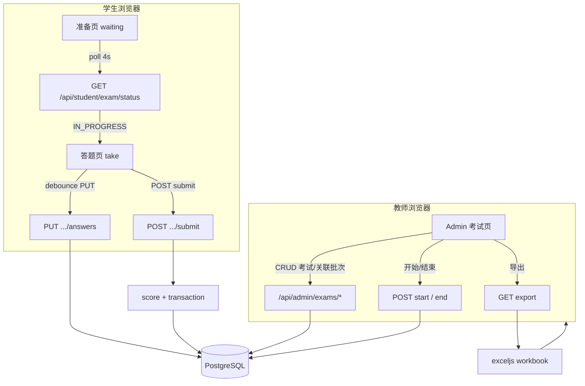

# Phase 4: 考试、提交与导出 - Research

**Researched:** 2026-05-16  
**Domain:** Exam lifecycle (三态), roster-bound student papers, objective scoring (QBANK-02), submission immutability (EXAM-02), teacher exports (EXPR)  
**Confidence:** HIGH（栈、Phase 1–3 模式、Prisma/会话/ExcelJS 已落地）；MEDIUM（Planner discretion 默认方案，待 plan-phase 写入 ACCEPTANCE）

> **Session note (2026-05-17):** Phase 3 使用 **单 `sid` + `studentRosterEntryId` 字段**（非 `student_sid` 双 Cookie）。见 `03-CONTEXT.md` D-05 修订。

## Summary

Phase 4 在既有 **Fastify + Prisma + PostgreSQL + React + exceljs** 栈上新增 **考试域**：教师创建考试并关联 **题目导入批次** 与 **名单导入批次**，经显式 **开始考试 / 结束考试** 驱动三态（D-01～D-04）；名单内学生在准备页 **3～5s 轮询** 开考状态后进入答题；作答 **服务端自动保存草稿**、**一次性提交** 后不可再改（EXAM-02 默认策略）；**提交时服务端计分** 并持久化，阅卷逻辑 **必须** 与 `02-ACCEPTANCE.md` 的 `MultiScoringRule.ALL_OR_NOTHING` 一致；教师导出 **成绩汇总** 与 **题目级明细**（EXPR），导出中对身份证号 **脱敏**（Planner 建议，对齐 `PROJECT.md` 合规语境）。

当前 `prisma/schema.prisma` **无** `Exam` / `Submission` 模型；`StudentWaiting.tsx` 仅有静态等待文案、**无轮询**；`AdminDashboard`「考试」卡片为 disabled；`apps/server` 无 exam/scoring/export 路由。Phase 3 已交付 `studentRosterEntryId` 会话与 `RosterEntry.batchId`，本阶段 **必须** 在每次拉题/保存/提交时校验：`session.rosterEntryId` 属于当次考试绑定的 `rosterBatchId` 且 `Exam.status === IN_PROGRESS`（`03-ACCEPTANCE.md` Phase 4 消费说明）。

**Primary recommendation:** `Exam` + `ExamQuestion`（按题目批次整批关联 + `sortOrder`）+ `Exam.rosterBatchId` + `AnswerDraft`（进行中自动保存）+ `Submission`/`Answer`（提交时事务计分，`@@unique([examId, rosterEntryId])`）+ 学生 `GET /api/student/exam/status` 轮询 + 教师 `POST .../start|end` + **exceljs** 双工作表导出（汇总 + 明细，证号脱敏）。

## Architectural Responsibility Map

| Capability | Primary Tier | Secondary Tier | Rationale |
|------------|-------------|----------------|-----------|
| 考试三态与开始/结束 | API / Backend | Admin UI | D-02/D-04：仅教师显式动作改状态 |
| 组卷（题目批次 + 顺序） | API / Backend | Admin UI | 权威关联在 DB；UI 选批次/调序 |
| 名单准入（批次绑定） | API / Backend | — | `rosterEntry.batchId === exam.rosterBatchId` |
| 准备页开考轮询 | Browser / Client | `GET /api/student/exam/status` | D-03：短轮询 + 自动跳转 |
| 试卷下发（题干/选项，无答案） | API / Backend | Browser 渲染 | 防泄题；答案仅服务端计分 |
| 作答草稿自动保存 | API / Backend | Browser debounce | 内网断电风险；非 UX-01 会话恢复 |
| 提交与 EXAM-02 约束 | API / Backend | — | 唯一 `Submission`；已结束拒绝 |
| 客观题计分（QBANK-02） | API / Backend | — | 复用 `normalize-answer` / `splitAnswerTokens` |
| 管理端提交列表/成绩 | Browser / Client | Admin API | 教师只读查看 |
| 成绩/明细导出 | API / Backend（exceljs 流） | Browser 下载 | EXPR-01/02；大文件不占前端内存 |
| 导出身份证脱敏 | API / Backend | — | `PROJECT.md` 合规；与 D-06 学生端全号展示分离 |

<user_constraints>
## User Constraints (from CONTEXT.md)

### Locked Decisions

- **D-01:** 考试采用 **三态**：**草稿 → 进行中 → 已结束**。进入「已结束」后 **学生不可再作答**（或不可再提交，与提交策略在 plan-phase 与 EXAM-02 对齐）；**教师仍可查看 / 导出** 等只读能力由实现与 EXPR 验收约定。
- **D-02:** 从 **草稿** 进入 **进行中** 必须由教师 **显式操作「开始考试」**（或等价文案），**不** 采用「学生首次打开试卷即自动开考」等隐式触发。
- **D-03:** 学生在 **准备页**（`/exam/waiting` 及等价路径）上，通过 **短轮询** 检测考试是否已进入「进行中」；轮询间隔建议 **约 3～5 秒**（确切值与退避策略由 plan-phase 按内网负载取值）；检测到可开考后 **自动跳转** 至答题入口/答题页（具体 URL 由规划定义）。
- **D-04:** 从 **进行中** 进入 **已结束** 必须由教师 **显式「结束考试」**（或等价文案）；**不** 将「全员提交后自动结束」作为 **唯一** 收卷方式。若日后增加「全员提交则自动结束」作为辅助，**本次未锁定**。

### Claude's Discretion

- **组卷与题目关联**（原灰区 2）：题目来源（全库 / 批次）、顺序、是否全员同卷等。
- **名单关联方式**（原灰区 3）：绑定整批导入、勾选条目、默认批次策略；非名单内已登录学生的错误处理。
- **作答保存与答题 UX**（原灰区 4）：自动保存草稿、单页/逐题、提交前是否可改答案等。
- **提交与重复提交 EXAM-02**（原灰区 5）：拒答再交 / 覆盖 / 只读查看；未提交是否计分或标未交等。
- **计分与成绩展示**（原灰区 6）：提交时算分 vs 批量算分；管理端逐题预览等。
- **导出格式与脱敏 EXPR**（原灰区 7）：CSV vs Excel 主交付、汇总/明细分文件、证号导出形态等。

### Deferred Ideas (OUT OF SCOPE)

- v2 `SEC-*`、`UX-01` 等见 `.planning/REQUIREMENTS.md` v2 段。
- 组卷、名单绑定、作答 UX、提交与重复提交、计分展示、导出与脱敏等 **未在 discuss 锁定** 的细项 — 本研究给出 **默认建议**，plan-phase 写入 PLAN / ACCEPTANCE。
</user_constraints>

<phase_requirements>
## Phase Requirements

| ID | Description | Research Support |
|----|-------------|------------------|
| EXAM-01 | 教师能为一次考试关联已导入题目与名单，学生仅能看到属于自己的试卷并完成作答与提交 | `Exam` + `questionBatchId` + `rosterBatchId` + `ExamQuestion`；学生 `GET /paper` 过滤 `rosterEntryId`；准入校验见 `lib/exam/access.ts` |
| EXAM-02 | 学生提交后不能在未授权情况下修改答卷；同一学生在同一考试重复提交行为有明确提示或拒绝策略 | `Submission @@unique([examId, rosterEntryId])`；提交后禁止 `AnswerDraft` 写入；重复 `POST /submit` → **409** + 明确中文提示；已提交可 `GET` 只读回放 |
| EXPR-01 | 教师能导出一次考试的成绩汇总（至少包含学生标识、总分、是否提交） | `GET /api/admin/exams/:id/export/summary` → exceljs 工作表「成绩汇总」 |
| EXPR-02 | 教师能导出答题明细（每题作答选项/对错、得分），格式便于存档（如 CSV 或 Excel 之一） | 同文件第二工作表「答题明细」或同次下载 `.xlsx`；列：姓名、脱敏证号、题序、题型、所选、正确答案、对错、得分 |
</phase_requirements>

## Project Constraints (from .cursor/rules/)

- **GSD Workflow:** 实现应经 `/gsd-execute-phase` 等 GSD 流程；本文件仅供给 plan-phase。[VERIFIED: `.cursor/rules` gsd-workflow block]
- **合规与隐私：** 身份证号敏感；导出/日志策略需在验收中明确 — 本阶段 export **默认脱敏**，日志 **禁止** 记录完整证号。[VERIFIED: `.cursor/rules` + `PROJECT.md` Constraints]
- **局域网单考场 v1：** 不追求多租户/公网；并发以单批次可行为目标。[VERIFIED: `PROJECT.md`]

## Planner Discretion — Recommended Defaults

> 以下为本研究的 **定案建议**（非用户锁定）；plan-phase 应写入 `04-ACCEPTANCE.md` 除非与用户冲突。

| 主题 | 建议 | 理由 |
|------|------|------|
| 题目关联 | 绑定 **`QuestionImportBatch`（整批）** + `ExamQuestion` 快照 `questionId` + `sortOrder`（默认按批次内 `createdAt` 升序） | 与 Phase 2 教师心智一致；避免逐题勾选 UI 成本 |
| 名单关联 | 绑定 **`RosterImportBatch`（整批）**；准入：`RosterEntry.batchId === exam.rosterBatchId` | Phase 3 已预留 `batchId`；`03-ACCEPTANCE.md` |
| 非名单学生 | 已登录但 `batchId` 不匹配 → **403** 笼统文案「当前无法参加本场考试」 | 不泄露考试是否存在 |
| 同卷 | **全员同卷**（同一 `ExamQuestion` 集合） | v1 无乱序（SEC-02 在 v2） |
| 自动保存 | **`AnswerDraft` 表** + 前端 debounce **2s** `PUT /api/student/exam/answers` | 提交前可改；不替代 UX-01 |
| 答题 UX | **单页滚动** 列出全部客观题 + 底部「提交试卷」确认 Dialog | MVP 实现量小于逐题向导 |
| EXAM-02 | **首次提交后拒绝再交**（409）；允许 **`GET` 只读查看** 自己的已提交答卷；**未提交** 在汇总导出中标「未提交」、总分空或 0（ACCEPTANCE 二选一，建议 **空总分 + 未提交标志**） | 审计清晰；防篡改 |
| 计分时机 | **提交时** 在单事务内算分并写 `Submission` + `Answer` | 导出与列表直接读库；无需夜间批处理 |
| 管理端成绩 | 列表：姓名、脱敏证号、总分、提交时间；可选进入 **只读逐题** 预览（教师） | EXAM-01 管理端可见提交 |
| 导出主格式 | **Excel `.xlsx`（exceljs）**，UTF-8；单文件 **两工作表**（汇总 + 明细） | 项目已依赖 exceljs；中文与多表友好 [VERIFIED: `apps/server/package.json`] |
| 证号导出 | **`maskNationalId(id) => 前6 + '********' + 后4`**（与教师端 roster 列表脱敏一致即可） | `PROJECT.md` 合规；学生端 D-06 仍全号 |
| 轮询间隔 | **4000ms**；页面 `document.hidden` 时 **暂停**；进入答题页停止 | D-03 建议区间中值；减负载 |
| 活跃考试解析 | **每名生仅匹配一场**：`status=IN_PROGRESS` 且 `rosterBatchId === entry.batchId`；若 0 场 → waiting；若 >1 场 → **规划须禁止**（DB 或 start 时校验「同 batch 仅一场进行中」） | 避免歧义 |

## Standard Stack

### Core

| Library | Version | Purpose | Why Standard |
|---------|---------|---------|--------------|
| @prisma/client | **6.8.2** | Exam / Submission 模型与事务 | 项目已用 [VERIFIED: root `package.json`] |
| fastify | **5.3.3** | Admin + Student exam API | 现有路由模式 [VERIFIED: `apps/server/package.json`] |
| zod | **4.4.3** | 请求体、查询参数 | 与 `verify.ts` 一致 |
| exceljs | **4.4.0** | EXPR 导出 xlsx | 已用于题库/名单导入 [VERIFIED: `npm view exceljs` + server deps] |
| express-session + connect-pg-simple | **1.19.0 / 10.0.0** | 单 `sid` + 字段隔离 | Phase 3 [修订 2026-05-17: 见 `03-CONTEXT.md` D-05] |
| react-router-dom | **7.x** | `/exam/waiting` → `/exam/take` | `router.tsx` 可扩展 |

### Supporting

| Library | Version | Purpose | When to Use |
|---------|---------|---------|-------------|
| 既有 `lib/qbank/normalize-answer.ts` | — | 计分前规范化选项 | **必须** 与导入管道一致 |
| @fastify/rate-limit | **10.3.0** | 提交/保存限流 | 防刷提交 |

### Alternatives Considered

| Instead of | Could Use | Tradeoff |
|------------|-----------|----------|
| exceljs 双表 xlsx | CSV 双文件 + UTF-8 BOM | CSV 多表体验差；可作为次要「兼容 WPS」文档说明 |
| `AnswerDraft` 表 | 仅存 browser localStorage | 换机/清缓存丢答案；不符合机房可靠性 |
| 提交时计分 | 教师点击「重新算分」 | v1 增加 UI；无主观题无需重算 |
| 覆盖式重复提交 | 拒绝再交（推荐） | 覆盖破坏审计链 |

**Installation:** 无新增运行时依赖。

## Architecture Patterns

### System Architecture Diagram



### Schema Design (Prisma)

```prisma
enum ExamStatus {
  DRAFT
  IN_PROGRESS
  ENDED
}

model Exam {
  id               String            @id @default(cuid())
  title            String
  status           ExamStatus        @default(DRAFT)
  teacherId        String
  questionBatchId  String
  questionBatch    QuestionImportBatch @relation(fields: [questionBatchId], references: [id])
  rosterBatchId    String
  rosterBatch      RosterImportBatch @relation(fields: [rosterBatchId], references: [id])
  startedAt        DateTime?
  endedAt          DateTime?
  createdAt        DateTime          @default(now())
  updatedAt        DateTime          @updatedAt
  questions        ExamQuestion[]
  submissions      Submission[]
  answerDrafts     AnswerDraft[]

  @@index([status])
  @@index([rosterBatchId])
  @@index([questionBatchId])
}

model ExamQuestion {
  id         String   @id @default(cuid())
  examId     String
  exam       Exam     @relation(fields: [examId], references: [id], onDelete: Cascade)
  questionId String
  question   Question @relation(fields: [questionId], references: [id])
  sortOrder  Int

  @@unique([examId, questionId])
  @@index([examId, sortOrder])
}

model Submission {
  id             String      @id @default(cuid())
  examId         String
  exam           Exam        @relation(fields: [examId], references: [id], onDelete: Cascade)
  rosterEntryId  String
  rosterEntry    RosterEntry @relation(fields: [rosterEntryId], references: [id])
  totalScore     Int
  submittedAt    DateTime    @default(now())
  answers        Answer[]

  @@unique([examId, rosterEntryId])
  @@index([examId])
}

model Answer {
  id             String     @id @default(cuid())
  submissionId   String
  submission     Submission @relation(fields: [submissionId], references: [id], onDelete: Cascade)
  examQuestionId String
  examQuestion   ExamQuestion @relation(fields: [examQuestionId], references: [id])
  selectedKeys   String     // 规范化后 "A" 或 "A,B,C"
  isCorrect      Boolean
  pointsAwarded  Int

  @@unique([submissionId, examQuestionId])
}

model AnswerDraft {
  id             String   @id @default(cuid())
  examId         String
  exam           Exam     @relation(fields: [examId], references: [id], onDelete: Cascade)
  rosterEntryId  String
  examQuestionId String
  examQuestion   ExamQuestion @relation(fields: [examQuestionId], references: [id], onDelete: Cascade)
  selectedKeys   String
  updatedAt      DateTime @updatedAt

  @@unique([examId, rosterEntryId, examQuestionId])
  @@index([examId, rosterEntryId])
}
```

**组卷物化：** 创建/编辑考试（`DRAFT`）时，从 `questionBatchId` 下所有 `Question` 生成 `ExamQuestion`（`sortOrder` 递增）。`DRAFT` 下允许重建题目列表；**进入 `IN_PROGRESS` 后禁止** 修改 `ExamQuestion`（或禁止改 `questionBatchId`）。

**状态迁移（D-01～D-04）：**

| 迁移 | 条件 | 副作用 |
|------|------|--------|
| → `IN_PROGRESS` | 仅 `DRAFT`；教师 `POST .../start` | `startedAt=now()`；校验至少 1 题、名单批次有条目；建议校验同 `rosterBatchId` 无其它 `IN_PROGRESS` |
| → `ENDED` | 仅 `IN_PROGRESS`；教师 `POST .../end` | `endedAt=now()`；拒绝新的 draft 保存与 submit |
| 非法 | `ENDED` → 任何 | 409 |

### API Surface

#### Admin（`preHandler: requireAdminSession`）

| Method | Path | Purpose |
|--------|------|---------|
| GET | `/api/admin/exams` | 列表（含 status、批次摘要、提交数） |
| POST | `/api/admin/exams` | 创建 `{ title, questionBatchId, rosterBatchId }` + 物化 `ExamQuestion` |
| GET | `/api/admin/exams/:id` | 详情 + 题目列表（无学生答案） |
| PATCH | `/api/admin/exams/:id` | 仅 `DRAFT`：改 title / 批次（若改批次则重建 ExamQuestion） |
| POST | `/api/admin/exams/:id/start` | D-02 |
| POST | `/api/admin/exams/:id/end` | D-04 |
| GET | `/api/admin/exams/:id/submissions` | 成绩列表（含未提交名单 optional expand） |
| GET | `/api/admin/exams/:id/submissions/:rosterEntryId` | 教师查看单生答卷（只读） |
| GET | `/api/admin/exams/:id/export` | EXPR-01+02 单 xlsx 流 `Content-Disposition: attachment` |

#### Student（`preHandler: requireStudentSession` + exam access guard）

| Method | Path | Purpose |
|--------|------|---------|
| GET | `/api/student/exam/status` | D-03 轮询：`{ examId, status, title }` 或 `{ status: 'none' }` |
| GET | `/api/student/exam/paper` | `IN_PROGRESS` 且已准入：题目+选项（**无** `answerKeys`） |
| PUT | `/api/student/exam/answers` | body: `{ examId, answers: [{ examQuestionId, selectedKeys }] }` upsert drafts |
| POST | `/api/student/exam/submit` | body: `{ examId }` → 计分 + 删 drafts + 建 Submission |
| GET | `/api/student/exam/submission` | 已提交只读回放（query `examId`） |

**`lib/exam/access.ts`（必建）：**

```typescript
// 伪代码 — 实现时返回 discriminated union / throw HTTP
async function assertStudentExamAccess(
  rosterEntryId: string,
  examId: string,
  mode: 'read' | 'write' | 'submit',
): Promise<{ exam: Exam; entry: RosterEntry }> {
  const entry = await prisma.rosterEntry.findUniqueOrThrow({ where: { id: rosterEntryId } });
  const exam = await prisma.exam.findUniqueOrThrow({ where: { id: examId } });
  if (entry.batchId !== exam.rosterBatchId) forbidden();
  if (mode !== 'read' && exam.status !== 'IN_PROGRESS') conflict();
  if (mode === 'submit' && exam.status === 'ENDED') conflict();
  // submit 模式另查是否已有 Submission
  return { exam, entry };
}
```

### Pattern 1: 准备页轮询与跳转（D-03）

**What:** `StudentWaiting` 在 `me` 成功后 `setInterval(4000)` 调用 `studentApi.examStatus()`；`status === 'IN_PROGRESS'` → `navigate('/exam/take', { replace: true })`（或带 `examId` query）。

**Example:**

```typescript
// apps/web/src/pages/StudentWaiting.tsx — 增量模式
useEffect(() => {
  if (!profile) return;
  const tick = async () => {
    const s = await studentApi.examStatus();
    if (s.status === 'IN_PROGRESS' && s.examId) {
      navigate(`/exam/take?examId=${s.examId}`, { replace: true });
    }
  };
  void tick();
  const id = setInterval(() => void tick(), 4000);
  return () => clearInterval(id);
}, [profile, navigate]);
```

### Pattern 2: 提交时计分事务

**What:** `POST submit` → `prisma.$transaction`：加载 `ExamQuestion`+`Question`；对每个 draft/题计分；`create Submission` + `createMany Answer`；`deleteMany AnswerDraft`；若已有 Submission → **409** 不回滚他人。

### Scoring Algorithm（QBANK-02 对齐）

**权威定义** [VERIFIED: `.planning/phases/02-qbank-import/02-ACCEPTANCE.md`]：

- `MULTI` + `multiScoringRule === ALL_OR_NOTHING`：所选集合与 `answerKeys` **完全一致** → `points`，否则 **0**
- `SINGLE` / `JUDGE`：规范化后字符串 **相等** → `points`，否则 0

**实现 MUST：**

1. 学员 `selectedKeys` 经 **`normalizeAnswerKeys(type, raw, optionKeys)`**（`apps/server/src/lib/qbank/normalize-answer.ts`）[VERIFIED: codebase]
2. 多选比较使用 **`splitAnswerTokens`** 后 `sort().join(',')` 与正确答案同样处理 [VERIFIED: `normalize-answer.ts`]
3. 若 `type === MULTI` 且 `multiScoringRule !== ALL_OR_NOTHING` → 记录错误（当前 schema 仅枚举 `ALL_OR_NOTHING`）

```typescript
// apps/server/src/lib/exam/score-question.ts — 建议新建
import type { Question, QuestionType } from '@prisma/client';
import { normalizeAnswerKeys, splitAnswerTokens } from '../qbank/normalize-answer.js';

export function scoreQuestion(
  q: Pick<Question, 'type' | 'answerKeys' | 'points' | 'multiScoringRule'>,
  optionKeys: string[],
  selectedRaw: string,
): { selectedKeys: string; isCorrect: boolean; pointsAwarded: number } {
  const selectedKeys =
    normalizeAnswerKeys(q.type, selectedRaw, optionKeys) ?? '';
  if (!selectedKeys) {
    return { selectedKeys: '', isCorrect: false, pointsAwarded: 0 };
  }

  let isCorrect = false;
  if (q.type === 'MULTI') {
    const sel = splitAnswerTokens(selectedKeys).join(',');
    const cor = splitAnswerTokens(q.answerKeys).join(',');
    isCorrect = sel === cor && q.multiScoringRule === 'ALL_OR_NOTHING';
  } else {
    isCorrect = selectedKeys === q.answerKeys;
  }

  return {
    selectedKeys,
    isCorrect,
    pointsAwarded: isCorrect ? q.points : 0,
  };
}
```

**单元测试（Wave 0 建议）：** 覆盖 MULTI 全对/少选/多选/错选、JUDGE `正确/错误`、SINGLE 非法选项 — 与 `02-ACCEPTANCE` 表一致。

### Pattern 3: 导出（EXPR）

**What:** `exportExamWorkbook(examId)` 使用 exceljs：

- Sheet **成绩汇总**：姓名、`maskNationalId`、总分、`submittedAt` 或「未提交」
- Sheet **答题明细**：姓名、脱敏证号、题号、`type`、所选、`answerKeys`、对错、得分  
- 列宽与表头中文；`Content-Type: application/vnd.openxmlformats-officedocument.spreadsheetml.sheet`

**未提交考生：** `leftJoin` 名单批次下全部 `RosterEntry`，无 `Submission` 的行在汇总表标 `未提交`。

### Anti-Patterns to Avoid

- **前端计分或信任前端总分** — 违背 QBANK-02 与审计要求
- **把 `answerKeys` 下发给学生 API** — 泄题；仅 submit 响应可返回对错（若产品要即时反馈，ACCEPTANCE 另定）
- **用 `teacherId` session 访问学生卷** — 必须 `studentRosterEntryId` on unified `sid` session
- **ENDED 后仍接受 PUT answers** — 违反 D-01
- **隐式开考** — 违反 D-02
- **导出明文证号** — 与合规建议冲突（除非校方书面锁定明文导出）

## Don't Hand-Roll

| Problem | Don't Build | Use Instead | Why |
|---------|-------------|-------------|-----|
| xlsx 生成 | CSV 拼接转义 | **exceljs** | 合并单元格/中文/多表；已在依赖中 |
| 答案规范化 | 自写 split 规则 | **`normalize-answer.ts`** | 与导入不一致会导致冤案 |
| 会话 | 自研 JWT | **express-session + PG** | Phase 1/3 已交付 |
| 考试状态机散落 if |  ad-hoc 字符串 | **`ExamStatus` enum + 单一 `transitionExam()`** | 非法迁移集中校验 |
| 身份证校验 | 重复实现 | **`national-id.ts`** | Phase 3 已有 |

## Common Pitfalls

### Pitfall 1: 多场「进行中」考试同批名单

**What goes wrong:** 学生轮询到错误 `examId`。  
**Why:** 未在 `start` 时做唯一性约束。  
**How to avoid:** `start` 前 `findFirst({ status: IN_PROGRESS, rosterBatchId })` 拒绝；或 DB 部分唯一索引（PostgreSQL 需 partial index）。  
**Warning signs:** 同 batch 两次 start 成功。

### Pitfall 2: 计分与导入规范化不一致

**What goes wrong:** Excel 填 `A,B` 与 `B,A` 导入成功，学生选同集合却 0 分。  
**Why:** 计分未 `splitAnswerTokens`+sort。  
**How to avoid:** 共用 `score-question.ts` 单测。  
**Warning signs:** 教师预览全对、导出明细 0 分。

### Pitfall 3: 提交后仍可 PUT draft

**What goes wrong:** EXAM-02 表面通过、实际可改库。  
**How to avoid:** `submit` 事务删 draft；`PUT` 检查无 `Submission`。  
**Warning signs:** 重复 submit 返回 200 且分数变化。

### Pitfall 4: 双 session 写错 store

**What goes wrong:** `studentRosterEntryId` 写到教师 session。  
**How to avoid:** 仅用 `getRequestSession(request)` 写 `studentRosterEntryId` / `studentName`；`await saveSession()` [修订 2026-05-17 — 单 `sid`，非 dual middleware]。

### Pitfall 5: Excel 导出 OOM

**What goes wrong:** 大考场明细行数 = 人数 × 题数 过大。  
**How to avoid:** 流式 `workbook.xlsx.write(reply.raw)`；v1 规模上限写入 ACCEPTANCE（如 2000 人 × 200 题）。  
**Warning signs:** 导出超时或进程内存飙升。

## Code Examples

### 状态迁移（服务端）

```typescript
export async function startExam(examId: string, teacherId: string) {
  return prisma.$transaction(async (tx) => {
    const exam = await tx.exam.findUniqueOrThrow({ where: { id: examId } });
    if (exam.status !== 'DRAFT') throw conflict('仅草稿可开始');
    const conflict = await tx.exam.findFirst({
      where: { rosterBatchId: exam.rosterBatchId, status: 'IN_PROGRESS', NOT: { id: examId } },
    });
    if (conflict) throw conflict('该名单批次已有进行中的考试');
    const qCount = await tx.examQuestion.count({ where: { examId } });
    if (qCount === 0) throw conflict('尚未关联题目');
    return tx.exam.update({
      where: { id: examId },
      data: { status: 'IN_PROGRESS', startedAt: new Date() },
    });
  });
}
```

### 证号脱敏（导出）

```typescript
export function maskNationalId(id: string): string {
  if (id.length < 8) return '********';
  return `${id.slice(0, 6)}********${id.slice(-4)}`;
}
```

## Codebase Anchors

| Area | Path | Notes |
|------|------|-------|
| Prisma 模型 | `prisma/schema.prisma` | 新增 Exam 域；`Question`/`RosterEntry` 已存在 |
| 学生准备页 | `apps/web/src/pages/StudentWaiting.tsx` | 加轮询 + 跳转 |
| 学生路由 | `apps/web/src/router.tsx` | 新增 `/exam/take`；`StudentRoute` 守卫 |
| 学生 API 客户端 | `apps/web/src/lib/student.ts` | 扩展 `examStatus` / `paper` / `submit` |
| 学生会话 | `apps/server/src/lib/student-auth.ts`, `plugins/session.ts` | `studentRosterEntryId` |
| 学生守卫 | `apps/server/src/plugins/student-guard.ts` | 复用 |
| 管理守卫 | `apps/server/src/plugins/admin-guard.ts` | 复用 |
| 答案规范化 | `apps/server/src/lib/qbank/normalize-answer.ts` | 计分 MUST 复用 |
| 计分规则验收 | `.planning/phases/02-qbank-import/02-ACCEPTANCE.md` | QBANK-02 |
| Phase 4 消费 | `.planning/phases/03-roster-student-entry/03-ACCEPTANCE.md` | `studentRosterEntryId` |
| 管理端仪表盘 | `apps/web/src/pages/AdminDashboard.tsx` | 「考试」卡片启用 → `/admin/exams` |
| 路由注册 | `apps/server/src/index.ts` | 注册 exam 路由模块 |
| 部署 | `docs/DEPLOY.md` | 内网 HTTP、代理 |

### Recommended Project Structure (incremental)

```
apps/server/src/
├── lib/exam/
│   ├── access.ts
│   ├── score-question.ts
│   ├── score-question.test.ts
│   ├── transition.ts          # start/end
│   ├── submit.ts            # transaction
│   └── export-workbook.ts
├── routes/api/admin/
│   ├── exams-crud.ts
│   ├── exams-lifecycle.ts
│   └── exams-export.ts
├── routes/api/student/
│   ├── exam-status.ts
│   ├── exam-paper.ts
│   ├── exam-answers.ts
│   └── exam-submit.ts
apps/web/src/
├── pages/AdminExams.tsx
├── pages/StudentExamTake.tsx
├── lib/exam.ts                # student + admin API types
prisma/migrations/...          # Exam 域
```

## State of the Art

| Old Approach | Current Approach | Impact |
|--------------|------------------|--------|
| 无考试实体 | Prisma `Exam` 三态 | 本阶段新增 |
| 准备页静态等待 | 轮询 + 自动跳转 | D-03 |
| 仅题库/名单 | 考试关联两批次 | EXAM-01 |

**Deprecated/outdated:** 无。

## Assumptions Log

| # | Claim | Section | Risk if Wrong |
|---|-------|---------|---------------|
| A1 | v1 允许同一部署多场考试，但 **同名单批次同时仅一场 IN_PROGRESS** | Planner defaults | 若需多场并行，status API 须返回 `examId` 列表并改 UI |
| A2 | 导出证号默认 **脱敏** 可接受校方 | EXPR / mask | 校方可能要求明文导出 → ACCEPTANCE 须确认 |
| A3 | 学生答卷 API **不返回标准答案** 直至提交后（或永不） | Security | 若教师要即时反馈需另议 |
| A4 | `SESSION_MAX_AGE_MS` 默认 24h 足够覆盖一场考试 | Environment | 超长考试需调 TTL |

## Open Questions (RESOLVED)

1. **未提交是否在汇总表显示 0 分还是空分？** — **RESOLVED:** 空分（总分列「—」）+ 「是否提交」列 Badge「未提交」。见 `04-ACCEPTANCE.md` EXPR-01。

2. **提交后学生是否可见正确答案？** — **RESOLVED:** `GET /api/student/exam/submission` 返回每题 `selectedKeys`、`isCorrect`、`pointsAwarded`；**不** 返回 `answerKeys` 或正确答案字符串（防传阅）。学生 UI 只读展示自己的选项与对错/得分。

3. **考试标题是否必填、是否支持多场历史考试列表？** — **RESOLVED:** `title` 必填（zod `.min(1)`）；`GET /api/admin/exams` 按 `createdAt desc`；同 `rosterBatchId` 同时仅一场 `IN_PROGRESS`。

## Environment Availability

Step 2.6: 本阶段依赖已在 Phase 1–3 验证的组件。

| Dependency | Required By | Available | Version | Fallback |
|------------|------------|-----------|---------|----------|
| PostgreSQL | Prisma / session | ✓（项目假定） | — | 无 — 阻塞 |
| Node + pnpm | 构建运行 | ✓ | — | — |
| exceljs | 导出 | ✓ | 4.4.0 | 无合理替代 |
| 浏览器 fetch + cookies | 学生/教师 UI | ✓ | — | — |

**Missing dependencies with no fallback:** 无（在标准 dev 栈下）。

## Security Domain

`workflow.security_enforcement: true`, ASVS L1 [VERIFIED: `.planning/config.json`]

### Applicable ASVS Categories

| ASVS Category | Applies | Standard Control |
|---------------|---------|------------------|
| V2 Authentication | yes | 既有教师登录 + 学生 verify；exam API 分轨 |
| V3 Session Management | yes | HttpOnly `sid`；`saveSession` on login/verify；regenerate when no teacherId |
| V4 Access Control | yes | `assertStudentExamAccess`；admin `teacherId` 归属校验 |
| V5 Input Validation | yes | zod body；`selectedKeys` 长度上限；`examQuestionId` 属于 exam |
| V6 Cryptography | no new | 无新密钥；分数不可客户端签名 |

### Known Threat Patterns

| Pattern | STRIDE | Standard Mitigation |
|---------|--------|---------------------|
| 非名单学生答题 | Elevation | `rosterEntry.batchId === exam.rosterBatchId` |
| 越权改他人答卷 | Tampering | `rosterEntryId` 仅来自 session，禁止 body 指定他人 |
| 已结束考试继续提交 | Tampering | `status === IN_PROGRESS` 才 `write/submit` |
| 重复提交刷分 | Tampering | `@@unique([examId, rosterEntryId])` + 409 |
| 导出数据泄露 | Information disclosure | 证号脱敏；导出路由 `requireAdminSession` |
| 日志证号泄露 | Information disclosure | 日志仅 `rosterEntryId` / `examId` |

## Sources

### Primary (HIGH confidence)

- `prisma/schema.prisma` — 现有 Question / Roster 模型
- `apps/server/src/lib/qbank/normalize-answer.ts` — 计分规范化
- `.planning/phases/02-qbank-import/02-ACCEPTANCE.md` — QBANK-02
- `.planning/phases/03-roster-student-entry/03-ACCEPTANCE.md` — Phase 4 消费
- `.planning/phases/04-exam-submit-export/04-CONTEXT.md` — D-01～D-04
- `apps/server/package.json` — exceljs 4.4.0
- `npm view exceljs version` → 4.4.0

### Secondary (MEDIUM confidence)

- `.planning/PROJECT.md` — 导出合规语境
- Phase 3 `03-RESEARCH.md` — 双 session、导入批次模式

### Tertiary (LOW confidence)

- 无

## Metadata

**Confidence breakdown:**

- Standard stack: **HIGH** — 仓库已用 Prisma/Fastify/exceljs/双 session  
- Architecture: **HIGH** — 锁定决策明确；默认方案与 Phase 2/3 对齐  
- Pitfalls: **MEDIUM** — 并发考试边界依赖 ACCEPTANCE 确认  

**Research date:** 2026-05-16  
**Valid until:** 2026-06-15（栈稳定）；导出脱敏策略若校方确认可延长

## RESEARCH COMPLETE

**Phase:** 4 - 考试、提交与导出  
**Confidence:** HIGH（栈与锁定决策）；MEDIUM（Planner 默认方案）

### Key Findings

- 无 `Exam` 模型；`StudentWaiting` 待加 **4s 轮询** 与跳转 `/exam/take`
- 组卷建议 **题目批次 + 名单批次** 双外键；准入靠 `rosterEntry.batchId`
- 计分 **必须** 复用 `normalize-answer.ts` + `ALL_OR_NOTHING` 集合相等
- EXAM-02 建议 **`Submission` 唯一约束 + 409**；提交事务内计分并删 draft
- EXPR 建议 **exceljs 双工作表** + 导出证号 **脱敏**

### File Created

`E:/programs/LAN_exam/.planning/phases/04-exam-submit-export/04-RESEARCH.md`

### Ready for Planning

Research complete. Planner can now create PLAN.md files (04-01～04-03).
