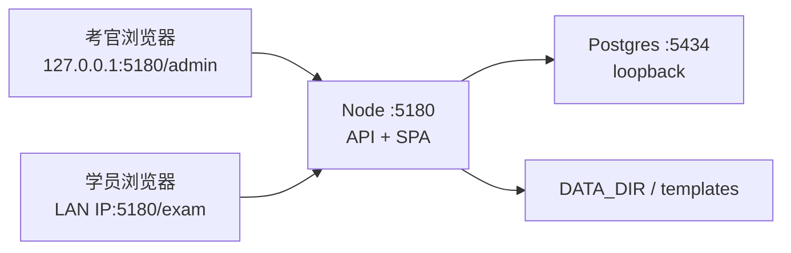
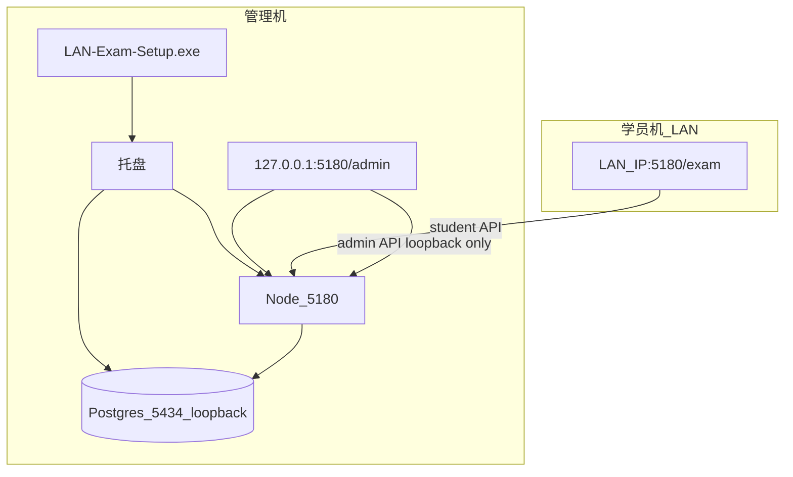

# 架构

## 技术栈

| 层 | 选型 | 备注 |
|----|------|------|
| 运行时 | Node.js 20+ | 便携 Node 打入 Windows Setup |
| API | Fastify 5 (`apps/server`) | `/api/admin/*`、`/api/student/*`、`/health` |
| 数据 | PostgreSQL + Prisma (`prisma/`) | 开发/Docker/便携实例端口 **5434** |
| 前端 | Vite + React SPA (`apps/web`) | 生产由同一 Node 托管 `dist` |
| 包管理 | pnpm monorepo | `@lan-exam/server`、`@lan-exam/web` |
| 考场交付 | Inno Setup + 托盘 (`tools/lan-exam-tray`) | 单进程 **5180** |

## 模块职责

- **考官域**：题库（客观/填空/操作批次）、名单批次、考试 CRUD、导出、设置（座位表开关、清数据）。数据归属 `resolveAdminTeacherId()`（免登录为 `local_exam_admin`）。
- **学员域**：登录（姓名+身份证号）、选考（进行中多场）、waiting/take/submitted/ended 状态机、作答保存与 `sync-progress`、交卷（手动/到点/deadline）。
- **考试引擎**：组卷物化（`materialize-questions`）、答卷缓存、评分（客观+填空自动）、deadline 调度与 `finalize-exam-submissions`。
- **存储**：`DATA_DIR` 下批次文件、学员上传、exam-work；模板在仓库 `templates/`。
- **不负责**：外网 CDN、多租户、操作题自动评分。

## 依赖关系

## 端口与环境形态

| 环境 | API | Web | DB |
|------|-----|-----|-----|
| `pnpm dev` | 3101 | 5180（Vite 代理 `/api`） | localhost:5434 |
| 生产 / Setup / Docker | 5180 合一 | 同上 | 127.0.0.1:5434 |

## 认证分层（考官）

1. `admin-loopback-guard` — `/api/admin/*` 仅 loopback；disabled 时 `/api/auth/*` 亦限本机。
2. `admin-guard` — session 模式校验 cookie；disabled 直接通过。
3. `admin-context` — 解析 `teacherId`（disabled → 固定本地账号）。

学员：`student-guard` 独立 session，可绑定 `examId`（选考后写入）。

## 目录约定（monorepo）

| 路径 | 职责 |
|------|------|
| `apps/server/src/lib/exam/` | 组卷、交卷、导出、状态解析 |
| `apps/server/src/lib/fillin/`、`practical/` | 题型专用逻辑 |
| `apps/server/src/routes/api/admin/`、`student/` | HTTP 路由 |
| `apps/web/src/pages/Student*.tsx` | 学员流程页 |
| `scripts/windows/` | 发版与安装脚本 |
| `prisma/` | schema + migrations |

细节落点见 [../AGENTS.md](../AGENTS.md)，此处不维护行号级索引。

## 部署拓扑

### 考场（Windows 原生，推荐）

构建机（有网）打包 Node + Postgres + VC++ + app → U 盘 → 考场离线安装。

### Docker / Linux 测试

- **默认 Compose**：bridge 网络，宿主机映射 5180 + 127.0.0.1:5434。
- **Linux host-app**：`network_mode: host`，对外常 **8001**；loopback 管理台经 SSH 隧道。
- **可选反代**：Nginx/IIS → `127.0.0.1:5180`，设 `TRUST_PROXY=true`。

详见 [DEPLOY.md](DEPLOY.md) 与 [../docs/DEPLOY.md](../docs/DEPLOY.md)。

## 外部集成

- **Postgres**：`DATABASE_URL`（见 `.env.example`）。
- **无第三方云 API**；考场禁止外网。
